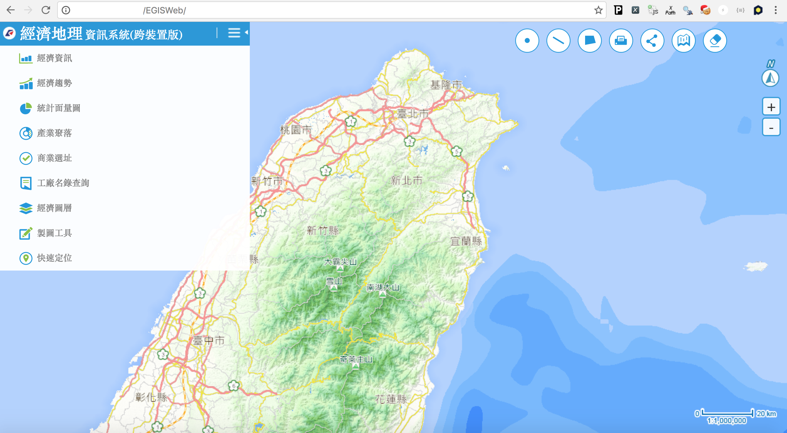

# 今天想跟大家聊聊`地圖`

## 從英國脫歐 {.fullpage}


## 從英國脫歐 {.fullpage}


## 到美國大選 {.fullpage}


## 到美國大選 {.fullpage}


## 到美國大選 {.fullpage}


## 台灣也不落人後（？ {.fullpage}


## 台灣也不落人後（？ {.fullpage}


## 台灣也不落人後（？ {.fullpage}


## 台灣也不落人後（？ {.fullpage}


## 台灣也不落人後（？ {.fullpage}


## 開放資料有很多圖資

- 可是要`怎麼用`？

- `經緯度`跟`坐標系`對不攏？

- `＃！＾＄＆％＊＃％`

首先來看看

## 空間單位 {.fullpage}

- 村里邊界

- 縣市邊界


## 空間單位 {.fullpage}

- 最小統計區


## 空間單位 {.fullpage}

- 經濟發佈區（`一級`／二級／三級）


## 空間單位 {.fullpage}

- 經濟發佈區（一級／`二級`／三級）


## 座標系統

- TWD97（台灣適用，較新）

- TWD67（台灣適用，較舊）

- WGS84（全球通用：經緯度）


把握一個重點：始終使用`同一種`座標系統

## 為了轉換資料要花很多力氣 {.fullpage}

來 `hack` 一下別人的系統（誤）

[經濟地理圖資供應中心：ＡＰＩ](http://egis.moea.gov.tw/MoeaEGPortal/index#MapApply)


## 在Ｒ裡面使用ＡＰＩ服務 {.fullpage}


## 在Ｒ裡面使用ＡＰＩ服務

```{r}
library(httr)
URL <- 'http://egis.moea.gov.tw/MoeaEGFxData_WebAPI_Inside/InnoServe/CodeSearchEcon/GetCount?'
QUERY <- list(x = 294129, y = 2774510)
res <- GET(url = URL, query = QUERY, encode = "json")
res
```

## 在Ｒ裡面使用ＡＰＩ服務

```{r}
str(content(res)[[1]][[1]]$properties)
```

## 在Ｒ裡面使用ＡＰＩ服務 {.fullpage}



## 在Ｒ裡面使用ＡＰＩ服務

```{r}
library(httr)
URL <- 'http://124.219.79.152/MoeaEGFxData_WebAPI_Inside/WebAPI/BizSite/Query?'
QUERY <- list(x = 302592, y = 2771367)
res <- GET(url = URL, query = QUERY, encode = "json")
res
str(content(res)[[1]])
```

# 今天主要是簡單的分享一下初入地圖坑的心得⋯⋯

# Ｑ＆Ａ

# 謝謝大家